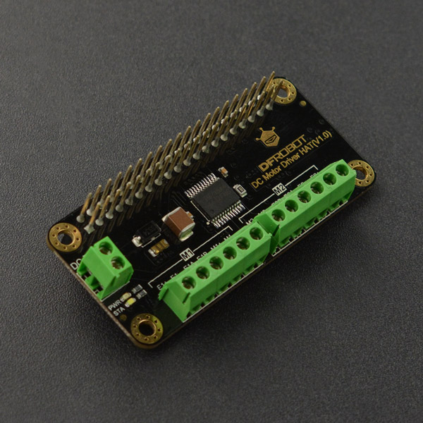

# DFRobot_RaspberryPi_Motor
* [中文版](./README_CN.md)

This RaspberryPi motor-driving board can communicate with RaspberryPi via IIC. <br>
It can control the motor to rotate forward and reserve, and rotation speed. <br>
The control command is IIC command and the drive command is PWM signal. <br>
The single-channel maximum operate current is 1.2A. The input port is compatible with GPIO port. <br>
With 2 independent output channels and 2 encoder ports, it can control 2 DC-motors or 2 motors with encoder. <br>
Application: RaspberryPi smart car, DIY tank, DIY micro-fish... <br>



## Product Link (https://www.dfrobot.com/product-1911.html)
    SKU: DFR0592


## Table of Contents
  - [Summary](#summary)
  - [Installation](#installation)
  - [Methods](#methods)
  - [Compatibility](#compatibility)
  - [History](#history)
  - [Credits](#credits)

## Summary

Provide a Raspberry Pi library for the DC Motor Driver HAT modules.

1. Two DC motors with encoder control or normal DC motors. <br>
2. Get motors speed form encoder. <br>
3. PWM frequency set. <br>
4. PWM duty set. <br>

## Installation

This Sensor should work with DFRobot_RaspberryPi_DC_Motor on RaspberryPi. <br>
Run the program:

```
python DC_Motor_Demo.py
```

## Methods

```python

  def begin(self):
    '''!
      @brief    Board begin
      @return   Board status
    '''

  def set_addr(self, addr):
    '''!
      @brief Set board controler address, reboot module to make it effective
      @param address   Address to set, range in 1 to 127
    '''

  def set_encoder_enable(self, id):
    '''!
      @brief Set dc motor encoder enable
      @param id   Encoder list, items in range 1 to 2, or id = self.ALL
    '''
  
  def set_encoder_disable(self, id):
    '''!
      @brief Set dc motor encoder disable
      @param id  Encoder list, items in range 1 to 2, or id = self.ALL
    '''

  def set_encoder_reduction_ratio(self, id, reduction_ratio):
    '''!
      @brief Set dc motor encoder reduction ratio
      @param id                Encoder list, items in range 1 to 2, or id = self.ALL
      @param reduction_ratio   Set dc motor encoder reduction ratio, range in 1 to 2000, (pulse per circle) = 16 * reduction_ratio * 2
    '''

  def get_encoder_speed(self, id):
    '''!
      @brief Get dc motor encoder speed, unit rpm
      @param id   Encoder list, items in range 1 to 2, or id = self.ALL
      @return  List of encoders speed
    '''

  def set_moter_pwm_frequency(self, frequency):
    '''!
      @brief Set dc motor pwm frequency
      @param frequency   Frequency to set, in range 100HZ to 12750HZ, otherwise no effective (actual frequency) = frequency - (frequency % 50)
    '''

  def motor_movement(self, id, orientation, speed):
    '''!
      @brief Motor movement
      @param id            Motor list, items in range 1 to 2, or id = self.ALL
      @param orientation   Motor orientation, self.CW (clockwise) or self.CCW (counterclockwise)
      @param speed         Motor pwm duty cycle, in range 0 to 100, otherwise no effective
    '''

  def motor_stop(self, id):
    '''!
      @brief Motor stop
      @param id   Motor list, items in range 1 to 2, or id = self.ALL
    '''

  def detecte(self):
    '''!
      @brief    If you forget address you had set, use this to detecte them, must have class instance
      @return   Board list conformed
    '''
```

## Compatibility

* RaspberryPi Version

| Board        | Work Well | Work Wrong | Untested | Remarks |
| ------------ | :-------: | :--------: | :------: | ------- |
| RaspberryPi2 |           |            |    √     |         |
| RaspberryPi3 |           |            |    √     |         |
| RaspberryPi4 |     √     |            |          |         |

* Python Version

| Python  | Work Well | Work Wrong | Untested | Remarks |
| ------- | :-------: | :--------: | :------: | ------- |
| Python2 |     √     |            |          |         |
| Python3 |     √     |            |          |         |


## History

- 2019/03/16 - Version 1.0.0 released.
- 2022/04/19 - Version 1.0.1 released.


## Credits

Written by tangjie(jie.tang@dfrobot.com), 2022. (Welcome to our [website](https://www.dfrobot.com/))
